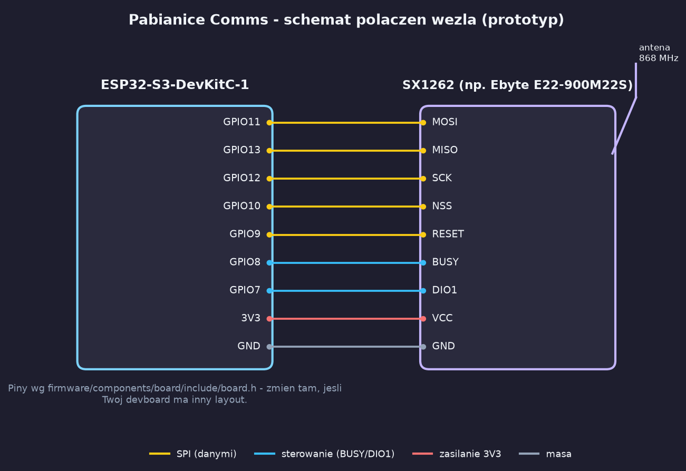

# 1. Montaż i okablowanie

## Co potrzebujesz

| Komponent | Przykład | Cena |
|---|---|---|
| Mikrokontroler | ESP32-S3-DevKitC-1 | 40-60 zł |
| Moduł radiowy | SX1262 (np. Ebyte E22-900M22S) | 50-70 zł |
| Antena | dookólna 868 MHz, złącze SMA | 20-30 zł |
| Zasilanie | ogniwo 18650 + moduł ładowania TP4056 | 30 zł |
| Przewody | goldpiny żeńsko-żeńskie, kilka sztuk | grosze |

Moduł bezpieczny (ATECC608A) i czujnik sabotażu z pełnego BOM-u (rozdz. 8.1 planu)
na tym etapie pomijamy - klucze na razie żyją w NVS (flash), nie w module bezpiecznym,
patrz `firmware/README.md`. Sam moduł bezpieczny to osobny temat sprzętowy na później,
niezależny od tego czy warstwa kryptograficzna w firmware już działa czy nie.

Do samego lutowania wystarczy podstawowa lutownica, jeśli Twój moduł SX1262 ma
goldpiny już wlutowane fabrycznie (większość tanich modułów z Aliexpress ma) -
w praktyce całość spinasz przewodami bez lutowania w ogóle.

## Schemat połączeń

| Sygnał | ESP32-S3 | SX1262 |
|---|---|---|
| MOSI | GPIO11 | MOSI |
| MISO | GPIO13 | MISO |
| SCLK | GPIO12 | SCK |
| NSS (CS) | GPIO10 | NSS |
| RESET | GPIO9 | RESET |
| BUSY | GPIO8 | BUSY |
| DIO1 | GPIO7 | DIO1 |
| 3V3 | 3V3 | VCC |
| GND | GND | GND |

Piny są zdefiniowane w `firmware/components/board/include/board.h` - jeśli Twój
devboard ma inne rozmieszczenie albo wolisz inne GPIO, zmień je tam. Reszta kodu
(sterownik radia, routing mesh) nic o konkretnych numerach pinów nie wie.

## Uwaga o antenie

**Nigdy nie włączaj nadajnika bez podłączonej anteny lub obciążenia 50 Ω.** Moduł SX1262
może się uszkodzić przy transmisji w otwarty obwód - odbite fale wracają do wzmacniacza
mocy. Przykręć antenę do złącza SMA, zanim pierwszy raz wgrasz i uruchomisz firmware.

## Zasilanie

Do testów na biurku wystarczy zasilanie z USB devboardu. Do pracy poza gniazdkiem
(np. test zasięgu po mieście) - ogniwo 18650 przez moduł TP4056, tak jak w BOM.
Nie łącz ogniwa bezpośrednio z pinem 3V3/VIN devboardu bez modułu ładowania/zabezpieczenia -
większość tanich devboardów nie ma na to osobnego wejścia i możesz spalić regulator.

Dalej: [2. Budowanie i flashowanie firmware](02-budowanie-firmware.md)
